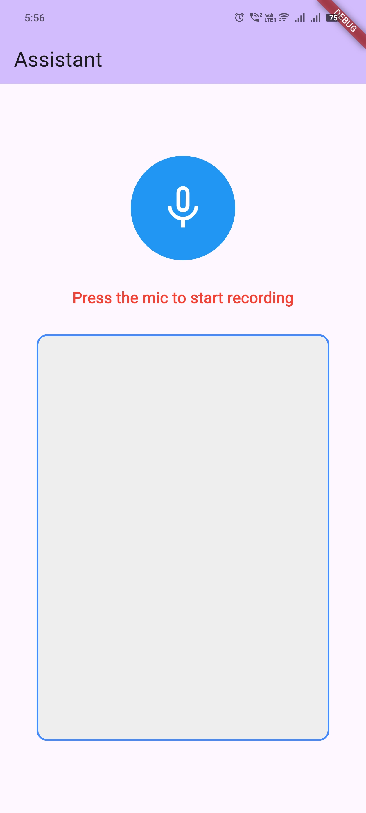
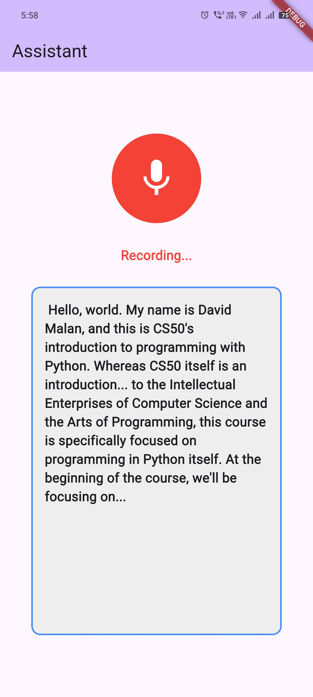

# Whisper API Demo

Sample flutter app to record your conversations and transcribe them using Whisper API.

## Features Added
- Transcription Service which uses OpenAI-Whisper API
- Proper chunking of audio sequence recorded to send to Whisper API
- Removal of silent parts from audio
- Screen to show microphone button and transcribed text

## Screenshots

